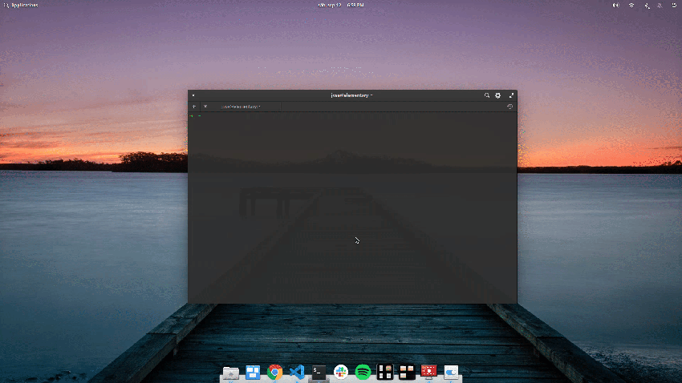
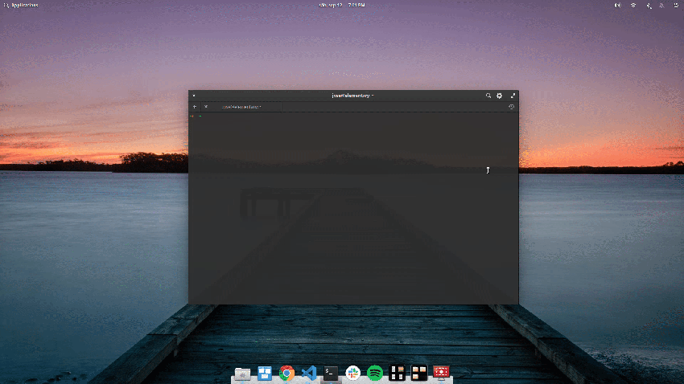
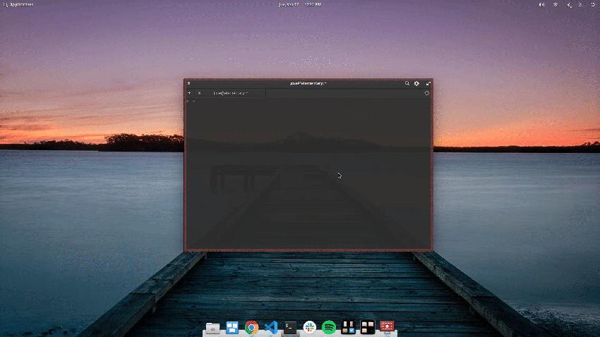
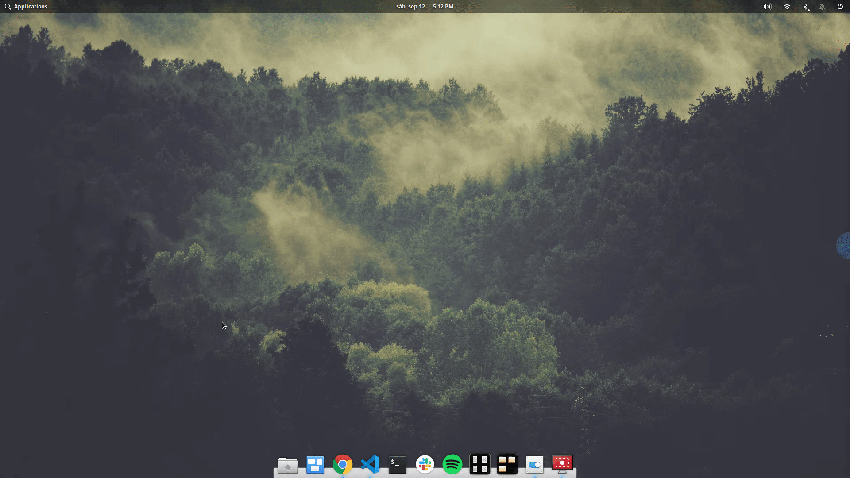
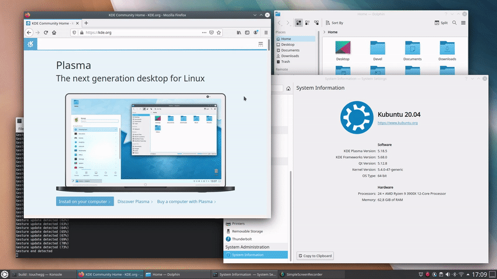
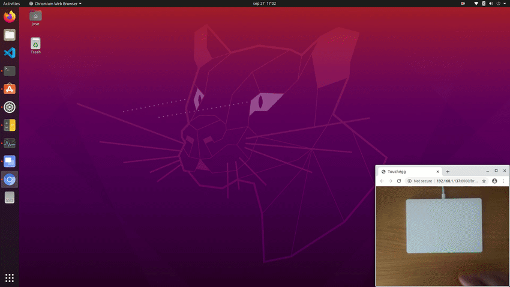

**Follow Touchégg on...** [](https://twitter.com/Jose__Exposito) <a href="https://www.paypal.com/cgi-bin/webscr?cmd=_donations&business=FT2KS37PVG8PU&currency_code=EUR&source=url"></a>


# Touchégg

Touchégg is an app that runs in the background and transform the gestures you make on your touchpad
into visible actions in your desktop.

For example, you can swipe up with 3 fingers to maximize a window or swipe left with 4 finger to
switch to the next desktop.

Many more actions and gestures are available and everything is easily configurable.


<p align="center">
  <a href="https://youtu.be/PLsH-XPFuN4">:movie_camera: Ubuntu demo</a>
  <br/>
  <a href="https://youtu.be/nuMT-MwyTXU">:movie_camera: elementary OS demo</a>
  <br/>
  <a href="https://www.youtube.com/watch?v=7gKONPKNZlc">:movie_camera: Touchscreen demo</a>
</p>

# Table of contents

  * [Installation](#installation)
  * [Configuration](#configuration)
    * [Global settings](#global-settings)
    * [Available gestures](#available-gestures)
      * [Swipe](#swipe)
      * [Pinch](#pinch)
      * [Tap](#tap)
    * [Available actions](#available-actions)
      * [Maximize or restore a window](#maximize-or-restore-a-window-maximize_restore_window)
      * [Minimize a window](#minimize-a-window-minimize_window)
      * [Tile/snap a widow](#tilesnap-a-widow-tile_window)
      * [Close a window](#close-a-window-close_window)
      * [Switch desktops/workspaces](#switch-desktopsworkspaces-change_desktop)
      * [Show desktop](#show-desktop-show_desktop)
      * [Keyboard shortcut](#keyboard-shortcut-send_keys)
      * [Execute a command](#execute-a-command-run_command)
      * [Mouse click](#mouse-click-mouse_click)
    * [Daemon configuration](#daemon-configuration)
  * [Copyright](#copyright)


# Installation

On the [releases](https://github.com/JoseExposito/touchegg/releases) page you will find a package
for your distribution.

Otherwise you can compile the source code yourself by following the instructions available in the
[HACKING.md](HACKING.md) file.

## Ubuntu, Debian and derivatives

Download the `.deb` package and install it. Double click on the package may work, otherwise install
it from the terminal:

```bash
$ cd ~/Downloads # Or to the path where the deb package is placed at
$ sudo apt install ./touchegg_*.deb # Install the package
```
Run Touchégg manually by running the command `touchegg` or reboot to get started.

## Red Hat, Fedora, CentOS and derivatives

Download the `.rpm` package and install it. Double click on the package may work, otherwise install
it from the terminal:

```bash
$ cd ~/Downloads # Or to the path where the rpm package is placed at
$ sudo yum localinstall touchegg-*.rpm # Install the package
```

Run Touchégg manually by running the command `touchegg` or reboot to get started.

## Arch Linux, Manjaro and derivatives

Install the `touchegg` package from [AUR](https://aur.archlinux.org/packages/touchegg/).

Run Touchégg manually by running the command `touchegg` or reboot to get started.

# Configuration

After [installing](#installation) Touchégg you'll notice that you can start using multi-touch
gestures. However, you are not forced to use the gestures and actions that come out of the box, you
can configure the gestures you'd like to use and the actions they'll trigger.

Start by copying the default configuration from `/usr/share/touchegg/touchegg.conf` to
`~/.config/touchegg/touchegg.conf`. You can do it using your file manager or by running this command
in your terminal:

```bash
$ mkdir -p ~/.config/touchegg && cp -n /usr/share/touchegg/touchegg.conf ~/.config/touchegg/touchegg.conf
```

Now open `~/.config/touchegg/touchegg.conf` with your favorite text editor.
It is a XML document with 3 main sections:

  * [Global settings](#global-settings)
  * Global gestures: `<application name="All">...</application>`
  * Application specified gestures: `<application name="Google-chrome,Firefox"></application>`

Find more information in the sections below.


## Global settings

| Option | Value | Default | Description | Example
| - | - | - | - | - |
| animation_delay | Number | 150 | Delay, in milliseconds, since the gesture starts before the animation is displayed | Use the MAXIMIZE_RESTORE_WINDOW action. You will notice that no animation is displayed if you complete the action quick enough. This property configures that time |
| action_execute_threshold | Number | 20 | Percentage of the animation to be completed to apply the action | Use the MAXIMIZE_RESTORE_WINDOW action. You will notice that, even if the animation is displayed, the action is not executed if you did not moved your fingers far enough. This property configures the percentage of the animation that must be reached to execute the action |
| color | Hex color | 3E9FED | Color of the animation | `#909090`
| borderColor | Hex color | 3E9FED | Color of the animation | `FFFFFF`


## Available gestures

### Swipe

From [libinput documentation](https://wayland.freedesktop.org/libinput/doc/latest/gestures.html#swipe-gestures):
Swipe gestures are executed when three or more fingers are moved synchronously in the same
direction.

Note that **three** is the minimum number of fingers that Touchégg allows for swipe gestures on
touchpads and **two** on touchscreens.

Example:

```xml
<gesture type="SWIPE" fingers="3" direction="UP">
  <action type="MAXIMIZE_RESTORE_WINDOW">
    <animate>true</animate>
  </action>
</gesture>
```

### Pinch

From [libinput documentation](https://wayland.freedesktop.org/libinput/doc/latest/gestures.html#pinch-gestures):
Pinch gestures are executed when two or more fingers are located on the touchpad and are either
changing the relative distance to each other (pinching) or are changing the relative angle (rotate).

Example:

```xml
<gesture type="PINCH" fingers="4" direction="IN">
  <action type="CLOSE_WINDOW">
    <animate>true</animate>
    <color>F84A53</color>
    <borderColor>F84A53</borderColor>
  </action>
</gesture>
```

### Tap

Tap gestures are executed when two or more fingers "click" on the touchscreen.

**Only available on touchscreens**

Example:

```xml
<gesture type="TAP" fingers="2">
  <action type="MOUSE_CLICK">
    <button>3</button>
    <on>begin</on>
  </action>
</gesture>
```


## Available actions

### Maximize or restore a window (MAXIMIZE_RESTORE_WINDOW)

Maximize the window under the pointer. If it is already maximized, restore it.

Options:

| Option | Value | Description |
| - | - | - |
| animate | `true`/`false` | Set it to `true` to display the animation. `false` otherwise. |
| color | Hex color | Color of the animation. For example: `909090` |
| borderColor | Hex color | Border color of the animation. For example: `#FFFFFF` |

Example:

```xml
<gesture type="SWIPE" fingers="3" direction="UP">
  <action type="MAXIMIZE_RESTORE_WINDOW">
    <animate>true</animate>
    <color>3E9FED</color>
    <borderColor>3E9FED</borderColor>
  </action>
</gesture>
```


### Minimize a window (MINIMIZE_WINDOW)

Minimize the window under the pointer.

Options:

| Option | Value | Description |
| - | - | - |
| animate | `true`/`false` | Set it to `true` to display the animation. `false` otherwise. |
| color | Hex color | Color of the animation. For example: `909090` |
| borderColor | Hex color | Border color of the animation. For example: `#FFFFFF` |

Example:

```xml
<gesture type="SWIPE" fingers="3" direction="DOWN">
  <action type="MINIMIZE_WINDOW">
    <animate>true</animate>
    <color>3E9FED</color>
    <borderColor>3E9FED</borderColor>
  </action>
</gesture>
```



### Tile/snap a widow (TILE_WINDOW)

Resize and move the window under the pointer to use half of the screen.

Options:

| Option | Value | Description |
| - | - | - |
| direction | `left`/`right` | Use the `left` or `right` half of the screen |
| animate | `true`/`false` | Set it to `true` to display the animation. `false` otherwise. |
| color | Hex color | Color of the animation. For example: `909090` |
| borderColor | Hex color | Border color of the animation. For example: `#FFFFFF` |

Example:

```xml
<gesture type="SWIPE" fingers="3" direction="LEFT">
  <action type="TILE_WINDOW">
    <direction>right</direction>
    <animate>true</animate>
    <color>3E9FED</color>
    <borderColor>3E9FED</borderColor>
  </action>
</gesture>

<gesture type="SWIPE" fingers="3" direction="RIGHT">
  <action type="TILE_WINDOW">
    <direction>left</direction>
    <animate>true</animate>
    <color>3E9FED</color>
    <borderColor>3E9FED</borderColor>
  </action>
</gesture>
```



### Close a window (CLOSE_WINDOW)

Close the window under the pointer.

Options:

| Option | Value | Description |
| - | - | - |
| animate | `true`/`false` | Set it to `true` to display the animation. `false` otherwise. |
| color | Hex color | Color of the animation. For example: `909090` |
| borderColor | Hex color | Border color of the animation. For example: `#FFFFFF` |

Example:

```xml
<gesture type="PINCH" fingers="4" direction="IN">
  <action type="CLOSE_WINDOW">
    <animate>true</animate>
    <color>F84A53</color>
    <borderColor>F84A53</borderColor>
  </action>
</gesture>
```



### Switch desktops/workspaces (CHANGE_DESKTOP)

Change to another desktop/workspace.

Options:

| Option | Value | Description |
| - | - | - |
| direction | `previous`/`next`/`up`/`down`/`left`/`right`/`auto` | The desktop/workspace to switch to. It is recommended to use `previous`/`next` for better compatibility. However, some desktop environments, like KDE, allow to configure a grid of desktops and `up`/`down`/`left`/`right` come in handy. With `SWIPE` gestures, `auto` will use your natural scroll preferences to figure out the direction. |
| animate | `true`/`false` | Set it to `true` to display the animation. `false` otherwise. |
| animationPosition | `up`/`down`/`left`/`right`/`auto` | Edge of the screen where the animation will be displayed. With `SWIPE` gestures, `auto` will use your natural scroll preferences to figure out the animation position. |
| color | Hex color | Color of the animation. For example: `909090` |
| borderColor | Hex color | Border color of the animation. For example: `#FFFFFF` |

Example:

```xml
<gesture type="SWIPE" fingers="4" direction="LEFT">
  <action type="CHANGE_DESKTOP">
    <direction>next</direction>
    <animate>true</animate>
    <animationPosition>right</animationPosition>
    <color>3E9FED</color>
    <borderColor>3E9FED</borderColor>
  </action>
</gesture>

<gesture type="SWIPE" fingers="4" direction="RIGHT">
  <action type="CHANGE_DESKTOP">
    <direction>previous</direction>
    <animate>true</animate>
    <animationPosition>left</animationPosition>
    <color>3E9FED</color>
    <borderColor>3E9FED</borderColor>
  </action>
</gesture>
```



### Show desktop (SHOW_DESKTOP)

Show the desktop. If the desktop is already being shown, restore all the windows.

Options:

| Option | Value | Description |
| - | - | - |
| animate | `true`/`false` | Set it to `true` to display the animation. `false` otherwise. |
| color | Hex color | Color of the animation. For example: `909090` |
| borderColor | Hex color | Border color of the animation. For example: `#FFFFFF` |

Example:

```xml
<gesture type="SWIPE" fingers="4" direction="DOWN">
  <action type="SHOW_DESKTOP">
    <animate>true</animate>
    <color>909090</color>
    <borderColor>FFFFFF</borderColor>
  </action>
</gesture>
```



### Keyboard shortcut (SEND_KEYS)

Emulate a keyboard shortcut.

Options:

| Option | Value | Description |
| - | - | - |
| repeat | `true`/`false` | Whether to execute the keyboard shortcut multiple times (default: `false`). This is useful to perform actions like pinch to zoom. |
| modifiers | Keysym | Typical values are: `Shift_L`, `Control_L`, `Alt_L`, `Alt_R`, `Meta_L`, `Super_L`, `Hyper_L`. You can use multiple keysyms: `Control_L+Alt_L`.See "Keysyms" below for more information. |
| keys | Keysym | Shortcut keys. You can use multiple keysyms: `A+B+C`. See "Keysyms" below for more information. |
| on | `begin`/`end` | Only used when `repeat` is `false`. Whether to execute the shortcut at the beginning or at the end of the gesture. |
| decreaseKeys | Keysym | Only used when `repeat` is `true`. Keys to press when you change the gesture direction to the opposite. You can use multiple keysyms: `A+B+C`. This is useful to perform actions like pinch to zoom, check `Example 2` below. |

Keysyms:

Keysyms can be found in two places:
 - Regular keys are in `/usr/include/X11/keysymdef.h`, you can open it with your favorite text editor.

   It is important to remove the `XK_` prefix. For example, the super keysym is defined as
   `XK_Super_L` but it must be used as `Super_L` in the configuration.
 - Special keys (e.g. media keys, browser back, sleep, etc.) are in `/usr/include/X11/XF86keysym.h`.

   Again, remove `XK_`, but leave the rest (including the bit before the
   `XK_`). For example, `XF86XK_Back` becomes `XF86Back`.

Note that only keysyms that are mapped onto a keycode can be used by
Touchégg. You can use `xmodmap -pk` to show the current mapping. To add
a keysym that is not mapped by default (for example `XF86ZoomIn`), you
can tell `xmodmap` to map it to any free keycode:

    xmodmap -e 'keycode any=XF86ZoomIn'

Example 1: Pinch to zoom example

```xml
<gesture type="PINCH" fingers="2" direction="IN">
  <action type="SEND_KEYS">
    <repeat>true</repeat>
    <modifiers>Control_L</modifiers>
    <keys>KP_Subtract</keys>
    <decreaseKeys>KP_Add</decreaseKeys>
  </action>
</gesture>

<gesture type="PINCH" fingers="2" direction="OUT">
  <action type="SEND_KEYS">
    <repeat>true</repeat>
    <modifiers>Control_L</modifiers>
    <keys>KP_Add</keys>
    <decreaseKeys>KP_Subtract</decreaseKeys>
  </action>
</gesture>
```

Example 2: Switch between windows (Alt+Tab)

```xml
<gesture type="SWIPE" fingers="3" direction="LEFT">
  <action type="SEND_KEYS">
    <repeat>true</repeat>
    <modifiers>Alt_L</modifiers>
    <keys>Shift_L+Tab</keys>
    <decreaseKeys>Tab</decreaseKeys>
  </action>
</gesture>

<gesture type="SWIPE" fingers="3" direction="RIGHT">
  <action type="SEND_KEYS">
    <repeat>true</repeat>
    <modifiers>Alt_L</modifiers>
    <keys>Tab</keys>
    <decreaseKeys>Shift_L+Tab</decreaseKeys>
  </action>
</gesture>
```

Example 3: Open Gnome application launcher

```xml
<gesture type="PINCH" fingers="4" direction="IN">
  <action type="SEND_KEYS">
    <repeat>false</repeat>
    <modifiers>Super_L</modifiers>
    <keys>A</keys>
    <on>begin</on>
  </action>
</gesture>
```



### Execute a command (RUN_COMMAND)

Run any command.

Options:

| Option | Value | Description |
| - | - | - |
| repeat | `true`/`false` | `true` if the command should be executed multiple times. `false` otherwise. |
| command | Command | The command to execute. |
| on | `begin`/`end` | Only used when `repeat` is `false`. If the command should be executed on the beginning or on the end of the gesture. |
| decreaseCommand | Command | Only used when `repeat` is `true`. Command to run when you change the gesture direction to the opposite. Check `Example 2` below. |

Example 1:

```xml
<gesture type="SWIPE" fingers="4" direction="DOWN">
  <action type="RUN_COMMAND">
    <repeat>false</repeat>
    <command>notify-send 'Hello' 'World'</command>
    <on>begin</on>
  </action>
</gesture>
```

Example 2:

```xml
<gesture type="SWIPE" fingers="4" direction="DOWN">
  <action type="RUN_COMMAND">
    <repeat>true</repeat>
    <command>notify-send 'Swipe direction' 'DOWN'</command>
    <decreaseCommand>notify-send 'Swipe direction' 'UP'</decreaseCommand>
  </action>
</gesture>
```

### Mouse click (MOUSE_CLICK)

Emulate a mouse click.

Options:

| Option | Value | Description |
| - | - | - |
| button | `1`/`2`/`3` | Left click (1), middle click (2) or right click (3) |
| on | `begin`/`end` | If the command should be executed on the beginning or on the end of the gesture. |

Example:

```xml
<gesture type="TAP" fingers="2">
  <action type="MOUSE_CLICK">
    <button>3</button>
    <on>begin</on>
  </action>
</gesture>
```


## Daemon configuration

This is an advanced topic and my recommendation is to ignore it.

Touchégg runs in two different processes, one of them is a systemd daemon configured in
`/lib/systemd/system/touchegg.service`. In addition to the `--daemon` argument, you can pass two optional arguments:

| Option | Value | Default | Description | Example
| - | - | - | - | - |
| start_threshold | Number | Calculated automatically according to your device characteristics | Amount of motion to be made on the touchpad before a gesture is started | Put 3 fingers on your touchpad. You will notice that the action does not start until you move them a little bit. This property configures how much you should move your fingers before the action starts |
| finish_threshold | Number | Calculated automatically according to your device characteristics | Amount of motion to be made on the touchpad to reach the 100% of an animation | Use the MAXIMIZE_RESTORE_WINDOW action. You will notice that you need to move your fingers a certain ammount until the animation fills your entire screen. This property configures how much you need to move your fingers |

It is recommended NOT to configure `start_threshold` and `finish_threshold` since an optimal value
is calculated for you. This value is printed to the terminal on application startup or when a
new multi-touch device is connected.

Example:

```bash
$ cat /lib/systemd/system/touchegg.service | grep ExecStart
ExecStart=/usr/bin/touchegg --daemon 100 500

$ sudo systemctl daemon-reload && sudo systemctl restart touchegg

$ journalctl -u touchegg -b -f
Compatible device detected:
  Name: Apple Inc. Magic Trackpad 2
  Size: 161.957mm x 115.114mm
  Calculating threshold and animation_finish_threshold. You can tune this values in your service file
  threshold: 100
  animation_finish_threshold: 500
```


# Copyright

Copyright 2011 - 2020 José Expósito <<jose.exposito89@gmail.com>>

The source code is available under GPL v3 license on [GitHub](https://github.com/JoseExposito/touchegg)
